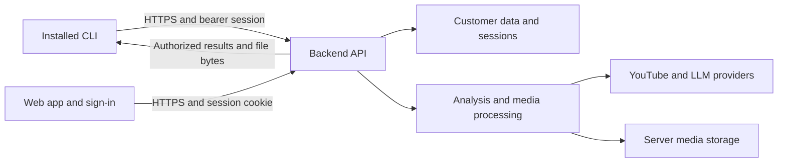

# CLI-only distribution and hosted backend

> **Status: IN PROGRESS** — approved 2026-09-15; implementation started on `codex/cli-only-distribution`. The package/build and release-verification slice is implemented. Hosted client configuration, customer ownership, and remote downloads remain open.
>
> Goal: publish a small CLI that signs in to the app and uses its backend for data, analysis, and video processing. The backend and web app are deployed separately from npm.

The recommendation is to keep the existing three-app source layout, give the CLI its own publish manifest and build artifact, and complete the remote-client contract. A repository-wide workspace migration is unnecessary for this change.

## What already exists

Baseline reviewed on 2026-09-10 at commit `428b598`; older architecture comments still describe local CLI media work. Concurrent uncommitted authentication work appeared during planning, including PKCE/loopback callback types and a transient CLI login store. Reconcile Phase 2 with that work before implementation; this plan does not require retaining the baseline polling protocol or its database tables.

| Area            | Current implementation                                                                                               | Remaining work                                                                                          |
| --------------- | -------------------------------------------------------------------------------------------------------------------- | ------------------------------------------------------------------------------------------------------- |
| CLI execution   | Commands use HTTP; even `run --clip` and `clip` call `POST /api/clips`.                                              | Tighten import restrictions and remove assumptions about sharing a filesystem.                          |
| Sign-in         | `login`, `logout`, `whoami`; browser approval; bearer sessions stored per backend origin.                            | Configure the hosted origin, validate responses, and verify the installed CLI against the deployed app. |
| npm package     | Root package exports the library and CLI; `files` includes all `dist`, `drizzle`, `scripts`, and `requirements.txt`. | Publish a dedicated CLI artifact with a separate dependency list.                                       |
| Build           | `tsconfig.build.json` compiles the library, API, and CLI together.                                                   | Add an independent CLI build; retain server builds for deployment.                                      |
| Release         | Builds, runs semantic-release, pulls `master`, then publishes the root directory to two registries.                  | Keep source and compiled output tied to one commit; verify and publish the final archive.               |
| Remote files    | CLI sends `localVideo`/`videoPath`; clip responses include server `path`/`editedPath`.                               | Use resource IDs and authenticated media downloads.                                                     |
| Authorization   | Session middleware resolves identity, but analyses, clips, Q&A and several other routes remain unguarded.            | Require sign-in and scope user-owned work, including files, to the customer.                            |
| Long operations | Analysis/Q&A stream over HTTP; clip generation holds a normal request open.                                          | Define interruption behavior; add durable jobs as a separate follow-up.                                 |

A local `npm pack --dry-run --ignore-scripts --json` preview of the existing build included **745 files**, about **311 KB compressed / 1.59 MB unpacked**: 112 API files, 288 service files, 44 orchestration files, 26 migration files, and 3 scripts. These counts describe the current checkout's build output, not a freshly rebuilt or registry-downloaded release. They exclude installed dependencies, which also currently include SQLite, AI providers, Hono, and media libraries.

## Target responsibilities

The CLI owns argument parsing, terminal output, HTTP requests, login credentials, connection preferences, and files the user explicitly downloads or exports. The backend owns business rules, authorization, source-video fetching, LLM calls, ffmpeg, persistence, provider credentials, rendering, and publishing. Writing a downloaded MP4 or `--output-json` on the client is still supported.

Shared request/response schemas and small utilities stay in `src/lib/types/` and `src/lib/utils/`; they can be compiled into the CLI without publishing the domain library. The npm package offers the `video-clipper` executable only.

## Phase 1 — Isolate the package

1. Add `packages/cli/package.json` as an explicit publish template, plus a CLI-specific README. Keep `src/app/cli/` in place. Mark the root package `private: true` in the same change that redirects the release workflow, so the root cannot be accidentally published.
2. Keep the npm name `@thunderkiller/video-clipper` and binary name `video-clipper`. Remove public library `main`, `module`, `types`, and `exports` entries from the publish template. Do not copy root dependencies or development lifecycle scripts into it.
3. Add `build:cli`, backed by a TypeScript build script, producing an isolated, ignored `artifacts/cli/` directory. Use an explicitly declared build-time bundler such as esbuild to compile the CLI entry and reachable internal modules into Node ESM. Preserve the executable shebang and ensure the installed command works on supported platforms.
4. Keep small third-party runtime dependencies explicit in the CLI manifest. The current graph needs Zod and nanoid; include `eventsource-parser` if used for the stream reader. The bundler resolves internal aliases but leaves these declared packages external. Build tooling remains a root development dependency.
5. Include only the executable output, package manifest, CLI README, and license in the release artifact. Exclude server code, migrations, Python, configuration machinery, media, and public library declarations. Verify the import graph as well as filenames: a bundle can hide server imports inside one file.
6. Extend `tests/architecture/serviceBoundaries.test.ts` to reject **all** CLI service, orchestration, pipeline, server-config, and other-app imports, including relative paths and transitive runtime edges. Permit only client-safe schemas/utilities. Update the stale local-media exception in `AGENTS.md` and source comments during implementation.

Changing `files` alone is insufficient: the package needs its own dependencies as well. npm documents file inclusion, executable mapping, and the root publication guard in its [package manifest reference](https://docs.npmjs.com/cli/v11/configuring-npm/package-json/).

**Exit condition:** an isolated installation of the tarball runs `--help` and `--version` without a backend, project checkout, provider keys, Python, ffmpeg, yt-dlp, or SQLite/native compilation. No server packages are present in the installed dependency tree.

## Phase 2 — Finish connection and sign-in behavior

Reuse the backend's browser sign-in and bearer sessions; do not create a second identity system. The baseline uses the device-style flow documented in `rbac-and-cli-auth.md`; concurrent work is changing the handoff to a PKCE-protected loopback callback. Integrate the settled handoff while preserving these user-visible steps:

1. `video-clipper login` starts sign-in with the backend and opens or prints its browser URL.
2. The user signs in through the app's existing backend identity flow.
3. The CLI completes a one-time, invocation-bound exchange and stores the resulting session under that backend origin. With the pending loopback design, the browser carries only a short-lived code; the CLI exchanges it using its PKCE verifier and validates callback state.
4. Every data request carries that bearer session. `whoami` resolves it server-side; `logout` revokes it and retains the existing failed-revocation retry behavior.

Add `--server <origin>` as a global option and persist the chosen origin when login succeeds. Resolve the backend using: explicit flag → existing `VIDEO_CLIPPER_API_URL` override → saved origin → configured hosted default. Until a production origin is provided, require an explicit origin for distributed builds; keep localhost opt-in for development.

Centralize CLI-only settings in `src/app/cli/client/config.ts`, with Zod schemas/types in `src/lib/types/command.ts`. Do not import the backend config loader just to read a server URL. Document the narrow client-config exception to the current environment-reading rule when implementing it. Split the credential-directory helper from package-root/Python path helpers if needed for a clean bundle.

Require HTTPS for remote origins, allow HTTP for loopback development, normalize origin keys, and prevent credentials being attached to foreign-origin requests or redirects. Keep the existing owner-only credential-file behavior and platform-specific protection. No provider API keys, Google client secret, or YouTube refresh tokens belong in the CLI.

Validate login, JSON, and SSE responses at runtime; baseline `apiGet<T>` only casts JSON. Honor code expiry and any polling intervals still supported, bound network waits, close loopback listeners and stream readers on cancellation, and distinguish unreachable-server, expired-session, permission, and incompatible-server errors. All help/version commands must work offline without fetching backend settings.

Use the configured app origin for browser links. The baseline derives it from `GOOGLE_OAUTH_REDIRECT_URI`; verify that the production callback, reverse proxy, and final login handoff agree. Validate restart and multi-instance routing behavior if the pending implementation keeps unfinished exchanges in memory. A small public capabilities response can advertise a contract version and supported operations; it must not expose server configuration. Track client/API compatibility separately from npm versions.

**Exit condition:** the installed CLI completes login → `whoami` → authenticated request → logout against a separate backend; expiry, denied access, interrupted login, unavailable backend, and switching origins behave predictably.

## Phase 3 — Make the API work for remote customers

Authentication already exists; user ownership still needs implementation before opening these workflows to multiple customers.

| Surface                                                           | Planned behavior                                                                                                                                                                                                                      |
| ----------------------------------------------------------------- | ------------------------------------------------------------------------------------------------------------------------------------------------------------------------------------------------------------------------------------- |
| Authentication/health                                             | Explicit public allowlist for the settled OAuth/CLI start, callback and one-time exchange endpoints, plus minimal health/capabilities. Any retained approval endpoint remains authenticated; signout preserves idempotent revocation. |
| Analyses, clips, Q&A, video details/transcripts, catalog requests | Sign-in required; enforce the app's existing linked-channel/access policy in the backend. Creating work cannot bypass it by supplying a video ID directly.                                                                            |
| User data                                                         | Scope lists, reads, edits, deletion, generation, files, and future jobs to the authenticated customer. Derive identity from the session, never a request `customerId`.                                                                |
| Settings                                                          | Restrict server configuration reads and writes to an explicit operator permission policy. Give ordinary clients only safe capabilities/defaults. Stop fetching the whole settings registry for progress banners.                      |
| Publishing and caption presets                                    | Include them in the ownership audit because the same backend serves the web app. User presets/drafts/uploads must be scoped; shared presets, if retained, are explicitly read-only.                                                   |

Add ownership to analyses, clips, Q&A history, drafts, uploads, and user presets, and pass customer context through orchestration and repository queries. Shared public video metadata can remain shared; generated work and private-source caches must not become accessible merely because two customers know the same video ID.

Audit segmentation/result cache keys, clip identifiers, media paths, and cleanup together. The current clip IDs and cache paths can be reused across analyses; adding `customer_id` only to tables would still allow collisions or deleting another customer's file. Namespace generated artifacts by owner/work, preserve cache checks inside that namespace, and keep cleanup within the authorized resource. Review analysis cache invalidation so one customer's reanalysis cannot replace another customer's results.

For existing global rows, migrate only records with known ownership. Leave ambiguous data inaccessible to customers until an operator explicitly assigns it; never assign it to whichever customer logs in first. Take a database/media backup and provide a dry-run migration report. Any still-global publishing credential path must be migrated to the current customer's stored identity or the hosted publishing operation must remain unavailable.

Replace the public clip-generation payload with analysis/candidate identifiers and allowed options. The backend loads the owned analysis, derives its video and selected segments, validates bounds, and applies its own resource/concurrency limits. Client-provided titles, durations, ranks, or `--max-parallel` must not determine access or bypass server limits. Preserve the web editor's supported input through an equally authorized, bounded contract.

Add client response schemas in `src/lib/types/api.ts` rather than returning internal database artifacts verbatim. Expose clip ID, filename, duration, render status, and a relative file endpoint; keep `path` and `editedPath` internal. Move filtering/pagination to the backend instead of fetching every clip and filtering in the CLI.

**Exit condition:** two signed-in customers cannot list, fetch, change, render, delete, or download each other's work; unauthenticated requests cannot trigger paid work or read protected data. Existing web flows pass with the same guards.

## Phase 4 — Replace shared-filesystem flags with downloads

| Command/option                                       | Remote-client behavior                                                                                                                        |
| ---------------------------------------------------- | --------------------------------------------------------------------------------------------------------------------------------------------- |
| `analyze`, `candidates`, `library`, `channel`, `ask` | Continue using backend data; validate responses and use server-side access/filtering rules.                                                   |
| `clip <analysis-id>`                                 | Generate on the backend and print clip IDs/status plus download instructions.                                                                 |
| `run <url> --clip`                                   | Compose backend operations and report the resulting analysis/clip IDs.                                                                        |
| New `download <clip-id> --output <path>`             | Save bytes from the authenticated clip file endpoint to the user's disk.                                                                      |
| New `clip ... --output-dir <directory>`              | Generate remotely, then download resulting clips into the chosen local directory.                                                             |
| `--output-json`                                      | Keep writing the returned analysis to a local file.                                                                                           |
| `--video-path`                                       | Remove with a clear migration error directing users to `--output-dir`; never send a client directory as a server override.                    |
| `--local-video`                                      | Reject in the first hosted release with an explanation. Supporting local sources later requires upload → owned asset ID → backend processing. |
| `config`                                             | Keep explicitly described as backend/operator configuration. Connection preferences live separately.                                          |

Reuse `GET /api/clips/:clipId/file` after adding ownership checks. Preserve byte-range support for the web player. Downloads should stream to a temporary file, validate completion, and rename on success; use safe filenames and require an explicit overwrite option. Tokens stay in headers. Report incomplete downloads without claiming the file is ready.

Remove filesystem override fields from all customer-facing API schemas, not just CLI parsing. Internal server operations may still receive paths chosen by trusted server code. Coordinate response and request changes with the web client before removing legacy fields.

For the first release, retain the current synchronous/SSE processing model if it passes realistic proxy timeout tests. Document that analysis is tied to its connection and that disconnecting from a clip request does not prove the render was cancelled. Implement explicit AbortSignal handling and report the actual semantics. Do not automatically replay creation/render requests after a timeout; first reconcile saved work, or use server-enforced idempotency when available.

**Exit condition:** a user on another machine can analyze, generate, list, and download a playable clip without installing media tools or knowing any server filesystem path.

## Phase 5 — Release a verified CLI artifact

1. Keep backend/web deployment and npm publication as separate outputs. The server deployment continues to contain migrations, media tooling, provider SDKs, secrets/configuration, and durable storage; the CLI artifact does not. Preserve the current registry package names unless deliberately changed.
2. Build from one checked-out commit with the frozen pnpm lockfile. Make release depend on the required CI checks for that commit. Serialize release jobs and remove the post-build `git pull` and root manifest mutation.
3. Let semantic-release determine the version from the existing tag history. Configure its npm plugin with `pkgRoot: artifacts/cli` and `npmPublish: false`; the plugin supports updating the package in that directory independently of the repository root. Treat the release tag and final CLI manifest as authoritative; do not assume the private root version was updated. See the [plugin's package-root/version behavior](https://github.com/semantic-release/npm#options).
4. In a release hook after version preparation, pack the final staged directory, validate the archive, and install that archive in an isolated temporary project. Then publish that **same `.tgz`** through the release publish hook. Do not rebuild or regenerate its manifest between verification and publication. Record version, source commit, file list, and checksum.
5. If GitHub Packages remains enabled, create a separate staged variant for `@amreetkumarkhuntia/video-clipper`, with the same executable bytes and release version. Pack and verify it separately; do not rename the repository package after publishing npm. Record each registry result so a partial failure can retry the missing publication without rebuilding or overwriting an existing version.
6. Add package-content and dependency assertions: allowlisted files, working executable, version agreement, no unresolved aliases/workspace paths, no server imports or native/media dependencies, no install-time build scripts. Measure packed and installed size rather than relying on a file-count target.
7. Install normally in clean Linux, macOS, and Windows environments, including the supported Node versions. Exercise help/version offline and HTTP/auth flows against a controlled backend. Use a local fake HTTP server for deterministic CLI protocol tests; reserve actual Google/YouTube/LLM/media execution for staging integration checks.
8. Adopt Node 22+ as the proposed CLI minimum and test Node 22/24, with Node 24 for release tooling. These are supported LTS lines as of this plan; this intentionally replaces the current Node 18 claim. Recheck support before release against the [Node release schedule](https://github.com/nodejs/Release).

Removing the advertised library exports and filesystem flags requires a **major release** under the existing package name. Publish a migration guide covering login, server selection, remote output, Node support, and the end of the public library API. Deploy the compatible backend first, validate a prerelease CLI, then promote the verified release. Maintain a stated API compatibility window; backend deployments should not force a CLI update unless the contract actually changes.

**Exit condition:** CI publishes only archives it built and verified from the release source commit. Fresh installation works independently of the repository, and the previous CLI's migration path is documented.

## Follow-up — Durable jobs

The existing [product foundation plan](./product-foundation.md) already owns background jobs. Reuse it rather than inventing a CLI-specific worker system. This is not required merely to shrink the package, but becomes a launch requirement if representative processing exceeds hosting request limits.

Introduce customer-owned jobs with persisted states, progress, result IDs, bounded concurrency, and idempotency keys. Enqueue returns a job ID promptly; CLI/web can poll or subscribe and reconnect. Add `jobs status`, `jobs wait`, and explicit cancellation. Closing the terminal detaches; it does not cancel a durable job. Persist cancellation requests and define recovery after server restarts, using retry-safe stages and existing cache behavior to avoid duplicate results. Start with the current backend and database deployment before introducing separate worker infrastructure.

## Delivery order and decisions

Suggested implementation slices, each with its own review and meaningful checks:

1. CLI package/build plus release redirection and archive verification; validate locally without publishing.
2. Backend-origin configuration, response validation, offline help/version, and existing sign-in polish.
3. Backend guards, ownership migration, resource/cache isolation, and safe client contracts.
4. CLI downloads, remote flag migration, and coordinated web changes.
5. Staging verification, migration documentation, and the major CLI release.
6. Durable jobs from the existing plan, moving ahead of launch if timeout testing requires them.

Phases 1–4 are developed and verified before publication. No package has been published from this implementation branch.

Defaults proposed here: keep the package/binary names; use one existing repo; backend performs all video work; local source upload follows later; reuse backend browser sign-in and bearer sessions; keep both existing registries until a separate decision changes that. Inputs still needed before release are the real hosted origin, deployment limits, and ownership assignment for legacy global data. These do not block the packaging work.

The companion plans remain the references for [completed authentication](./rbac-and-cli-auth.md), [product tenancy gaps](./product-restructure.md), and [background jobs](./product-foundation.md). This plan narrows those dependencies to what a distributed CLI needs.

## Implementation progress — 2026-09-15

- Created `codex/cli-only-distribution` from `98fbbd2`, retaining the completed auth and test-layout changes.
- Added the standalone manifest/build, import and package-content gates, offline help/version, normal-install verification, both registry variants, release receipts, and publication retry.
- Reused the shipped PKCE/browser authentication. No auth protocol or customer data changes in this slice.
- Full Vitest suite: 617 tests passed; the subsequently added development-publication guard and focused release checks also passed (8 focused tests). Server build and web type-check passed. Isolated npm installation passed locally on macOS/Node 24; the Linux/Windows/Node 22 matrix is configured for CI and has not run locally.
- Phases 2–4 and staging validation remain open. See [build and release instructions](../guides/cli-distribution.md).
