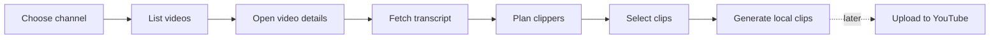
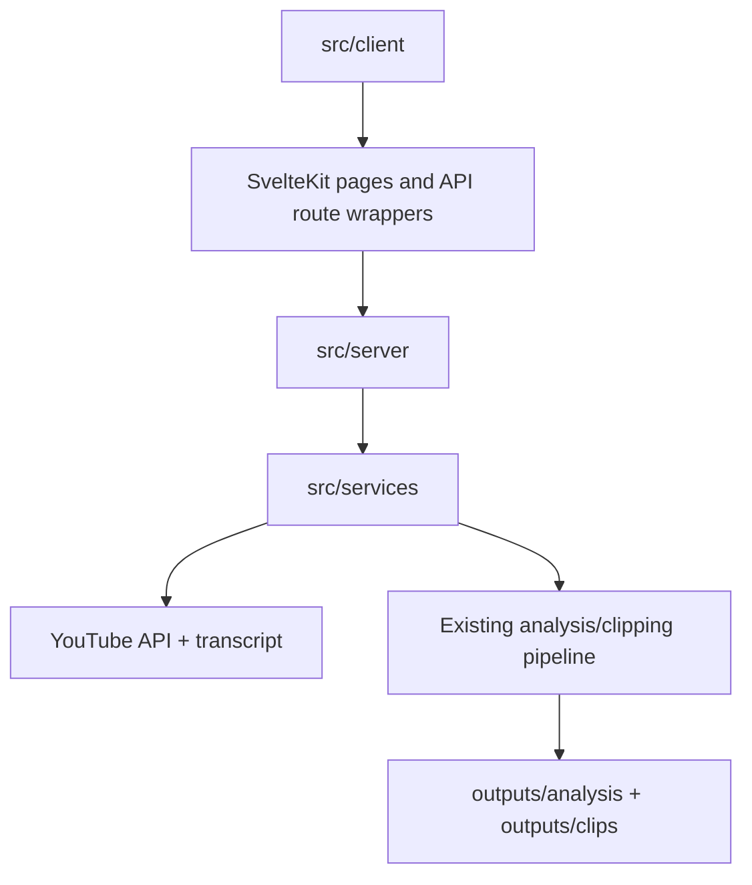
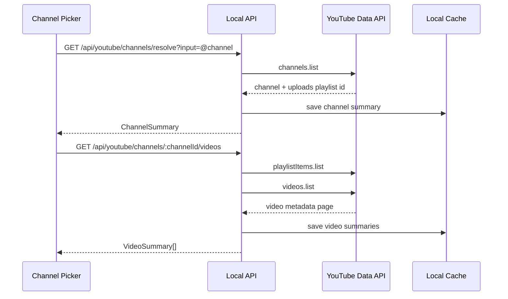
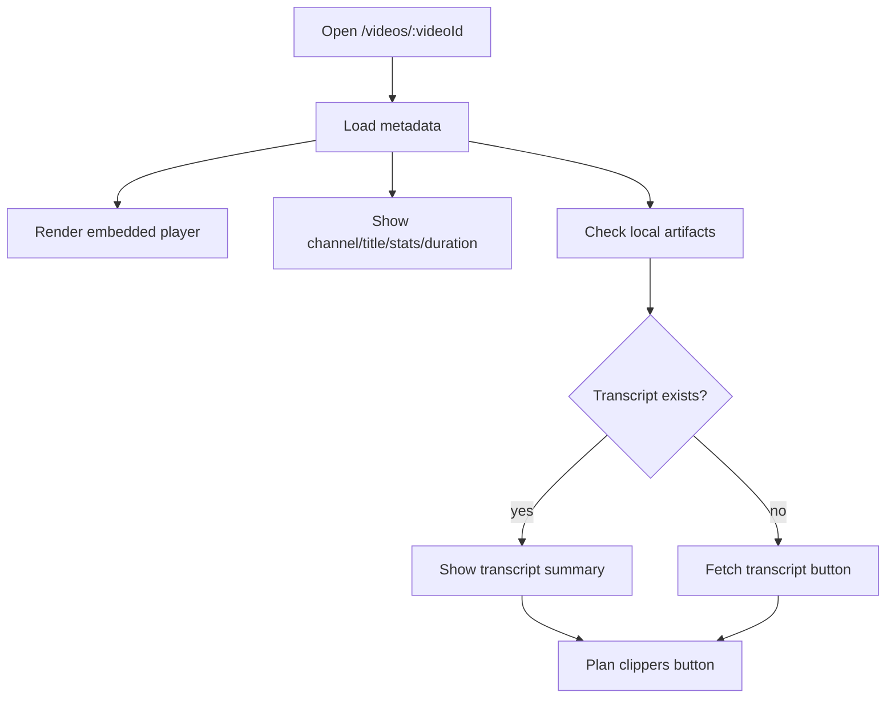
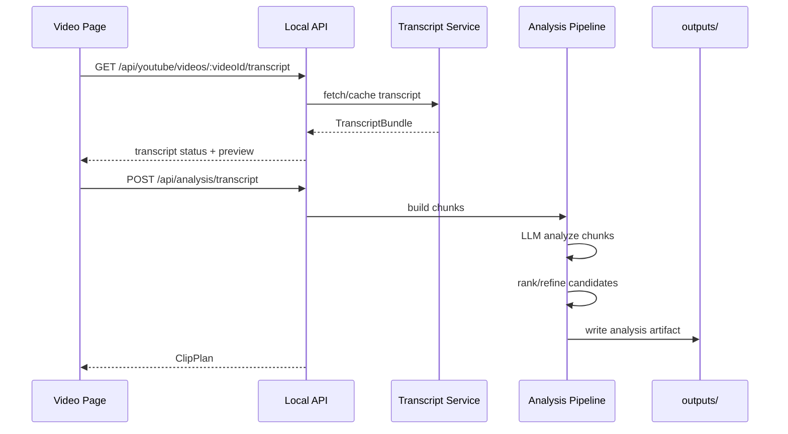
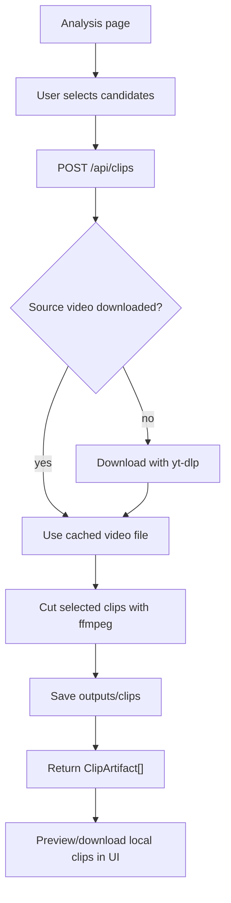
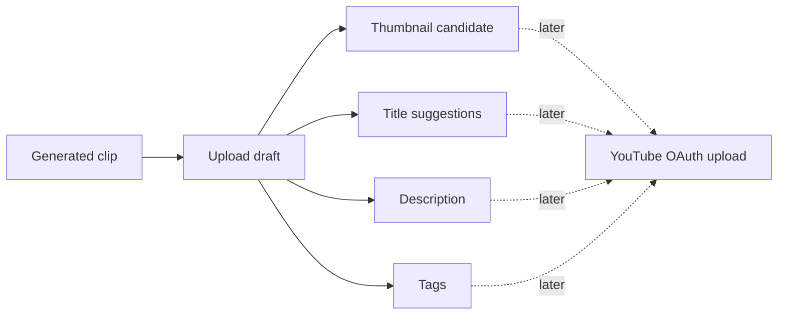

# Svelte Web Workbench Plan

## Goal

Convert the current TypeScript YouTube clipper CLI into a local SvelteKit web workbench while preserving the existing pipeline as the core engine.

The app should feel like a focused YouTube clipping workspace:

- choose a public channel
- browse that channel's videos in a YouTube-like layout
- open a video detail page
- fetch transcript/script data
- ask the backend to plan clip candidates
- review candidate moments in the frontend
- generate selected clips locally
- prepare for a later upload-to-YouTube flow

This is not a multi-user cloud app in the first version. It is a local, single-user tool that runs with local `.env` configuration, local cache/artifact storage, `yt-dlp`, and `ffmpeg`.

## Product Flow



The first usable milestone is browsing a channel and reaching a video detail page. The second usable milestone is planning clips from the selected video transcript. The third usable milestone is generating selected local clips.

No background job queue is required for the first implementation. The frontend should call explicit APIs such as `GET /api/youtube/channels/resolve`, `GET /api/youtube/videos/:videoId/transcript`, `POST /api/analysis/transcript`, and `POST /api/clips`, then show local loading/progress states while each request is active.

## App Architecture

Use SvelteKit with the Node adapter so server routes can access local files, validated private config, `yt-dlp`, `ffmpeg`, and LLM provider keys.



Responsibilities:

- `src/client` owns Svelte pages, UI components, stores, route-level data loading, and browser interactions.
- `src/server` owns private config, API handlers, local artifact reads/writes, request validation, and orchestration.
- `src/services` owns reusable domain services: YouTube channel lookup, video listing, transcript fetching, analysis, ranking, downloading, and clipping.
- Existing pipeline modules should move only as needed; do not rewrite the LLM/chunking/clipping logic just to add the frontend.

## Folder Structure

```text
src/
  client/
    routes/
      +layout.svelte
      +page.svelte
      channels/
        [channelId]/
          +page.svelte
      videos/
        [videoId]/
          +page.svelte
          analysis/
            [analysisId]/
              +page.svelte
      api/
        youtube/
          channels/
            resolve/
              +server.ts
            [channelId]/
              videos/
                +server.ts
          videos/
            [videoId]/
              +server.ts
              transcript/
                +server.ts
        analysis/
          transcript/
            +server.ts
        clips/
          +server.ts
        library/
          analyses/
            +server.ts
          clips/
            +server.ts
    components/
      channel/
      video/
      analysis/
      clips/
      layout/
    stores/
    styles/
  server/
    config/
    http/
    artifacts/
    youtube/
    analysis/
    clipping/
  services/
    youtube/
      channelGetter.ts
      videoGetter.ts
      transcriptGetter.ts
    analysis/
    clipping/
  types/
    web.ts
    youtube.ts
    analysis.ts
```

SvelteKit normally expects `src/routes`. Configure SvelteKit to use `src/client/routes` as the route directory so the requested `src/client`, `src/server`, and `src/services` split stays clear.

## YouTube Data Flow

Use the official `@googleapis/youtube` package for YouTube Data API v3 access. This keeps the dependency focused on YouTube instead of pulling in the broader `googleapis` package.

The service should support channel input as a channel ID, handle, or URL. Resolve that input to a normalized channel record, then list uploads from the channel uploads playlist.



Use `playlistItems.list` for public channel uploads because it has low quota cost and follows the uploads playlist. Use `videos.list` to enrich listed videos with duration, statistics, status, and player metadata. Avoid `search.list` for normal channel video listing because it costs more quota and is not needed for upload playlist browsing.

Wrap the package behind a local catalog interface so the rest of the app does not depend directly on the Google client shape:

```ts
interface YouTubeCatalogService {
  resolveChannel(input: string): Promise<ChannelSummary>;
  listChannelVideos(channelId: string, pageToken?: string): Promise<VideoPage>;
  getVideoDetails(videoId: string): Promise<VideoDetails>;
}
```

The v1 implementation should be `googleYouTubeCatalogService.ts` powered by `@googleapis/youtube`. A later optional fallback can add `innertubeCatalogService.ts` powered by `youtubei.js` if API-key or quota friction becomes a real problem.

## Video Detail Flow

The video detail page is the central workspace for one selected video.



The first version should show:

- embedded YouTube player
- title, channel, publish date, duration, views, likes if available
- description preview
- transcript status
- existing analysis status
- existing local clips for this video
- primary action: `Plan clippers`

## Transcript And Analysis Flow

Transcript fetching and LLM analysis should remain server-side. The frontend only sends the video ID and user-selected analysis options.



The analysis result should be stored as a local artifact so refreshing the browser does not force another LLM call.

Minimum clip candidate fields:

- `id`
- `rank`
- `startSec`
- `endSec`
- `score`
- `reason`
- `transcriptExcerpt`
- `selected`

## Clip Generation Flow

Clip generation is explicit and selection-based. The analysis page should allow the user to pick candidates and then send only selected segments to the backend.



Minimum clip artifact fields:

- `id`
- `videoId`
- `analysisId`
- `segmentId`
- `filename`
- `path`
- `startSec`
- `endSec`
- `durationSec`
- `createdAt`

Local media should be served through controlled server endpoints instead of exposing arbitrary filesystem paths to the browser.

## Future Upload Flow

YouTube upload is a later phase. The first implementation should design the output shape but not add OAuth or upload actions.



The upload draft should eventually include title, description, tags, visibility, playlist, thumbnail path, and source segment metadata. In v1, this can be shown as a read-only/exportable draft on the clip result page.

## API Surface

Initial local API endpoints:

| Method | Path                                                    | Purpose                                                   |
| ------ | ------------------------------------------------------- | --------------------------------------------------------- |
| `GET`  | `/api/youtube/channels/resolve?input=...`               | Resolve channel handle, ID, or URL to a `ChannelSummary`. |
| `GET`  | `/api/youtube/channels/:channelId/videos?pageToken=...` | List public uploaded videos for a channel.                |
| `GET`  | `/api/youtube/videos/:videoId`                          | Get full video details.                                   |
| `GET`  | `/api/youtube/videos/:videoId/transcript`               | Fetch or load cached transcript.                          |
| `POST` | `/api/analysis/transcript`                              | Analyze transcript and return a persisted clip plan.      |
| `POST` | `/api/clips`                                            | Generate local clips for selected candidates.             |
| `GET`  | `/api/library/analyses`                                 | List saved analysis artifacts.                            |
| `GET`  | `/api/library/clips`                                    | List saved clip artifacts.                                |

Shared response types should live under `src/types` and be reused by client and server code. Validate all incoming API request bodies with `zod`.

## Implementation Phases

1. Add SvelteKit shell and route directory configuration for `src/client/routes`.
2. Build the channel picker and video grid using mocked API data.
3. Add `googleapis` YouTube services and real channel/video API routes.
4. Add video detail page with metadata, embedded player, transcript status, and artifact status.
5. Refactor existing CLI pipeline into reusable analysis/clipping functions callable from server routes.
6. Add transcript analysis API and persisted analysis artifacts.
7. Add candidate review UI and selected clip generation API.
8. Add library views for previous analyses and clips.
9. Add upload draft UI only; keep actual YouTube upload/OAuth for a later phase.

## Testing And Acceptance Criteria

Test cases:

- channel input parser handles channel IDs, handles, and YouTube channel URLs
- YouTube API response mapping creates stable `ChannelSummary`, `VideoSummary`, and `VideoDetails` objects
- paginated video listing preserves `nextPageToken`
- transcript API returns cached transcript when available
- analysis request validation rejects missing `videoId` or invalid options
- analysis artifacts can be written, listed, and reloaded
- clip request validation rejects invalid segment ranges
- local media route refuses paths outside the configured output directory

Acceptance criteria:

- user can resolve a channel and browse its public uploaded videos
- user can open a video detail page and see metadata
- user can fetch or load a transcript
- user can generate clip candidates from transcript analysis
- user can select candidates and generate local clips
- generated analysis and clip artifacts remain visible after a page refresh
- no YouTube upload/OAuth work is implemented in the first pass

## Assumptions

- The app is local-only and single-user for v1.
- YouTube Data API access uses the `@googleapis/youtube` package and a server-side API key from validated config.
- `youtubei.js` is not part of v1, but the YouTube catalog service interface should leave room for it as a later fallback adapter.
- Existing rules still apply: do not read `process.env` directly outside config, validate external data with `zod`, and keep API keys out of client code.
- The first version avoids a full job queue. Long-running calls use page-level loading states and persisted artifacts.
- Upload-to-YouTube is planned but intentionally deferred.
- Existing CLI behavior should continue to work while the reusable pipeline is extracted for the web app.
